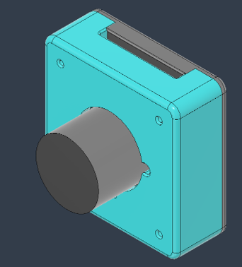
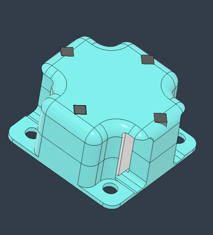
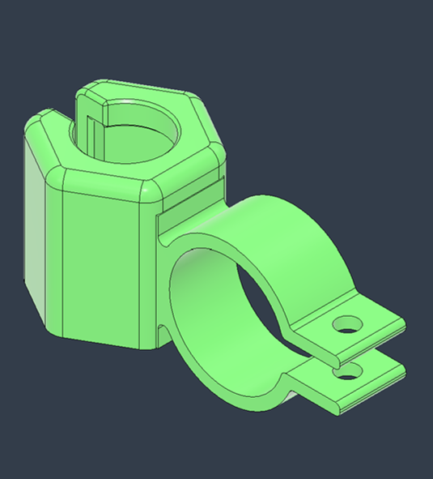
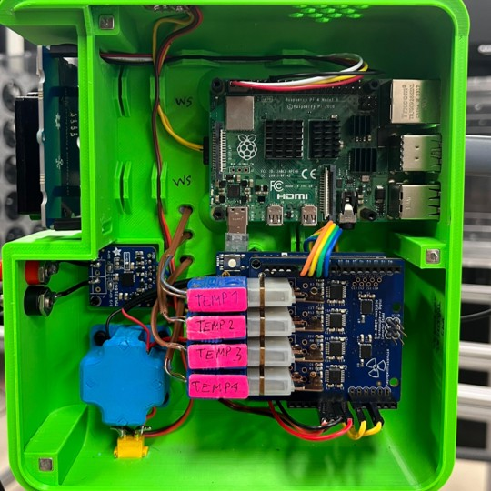

```{python}
#| echo: false
import thesis_tools as tt
```


## Introducción

El **Dispositivo de Temperatura, Humedad, Iluminación y Sonido de Campaña** (DTHIS-C) es un dispositivo portátil desarrollado para medir, de forma simultánea y en tiempo real, diversas variables físicas que inciden directamente en el confort de los espacios interiores. Las variables evaluadas son:

<ul>
  <li>Temperatura del aire</li>
  <li>Temperatura radiante</li>
  <li>Humedad relativa</li>
  <li>Velocidad del viento</li>
  <li>Concentración de CO<sub>2</sub></li>
  <li>Luminancia</li>
  <li>Niveles de sonido</li>
</ul>


El DTHIS-C está conformado por seis sensores, dos microcontroladores y dos acondicionadores de señal.

## Planteamiento del problema 

Actualmente gran parte de la vida ocurre en espacios interiores (aulas, oficinas, lugares de trabajo), donde el diseño no siempre considera el confort de los ocupantes, afectando bienestar e incluso la salud.

<ul>
  <li>Iluminación deficiente: Reduce la concentración y aumenta riesgos visuales.</li>

  <li>Ventilación inadecuada: Degrada la calidad del aire y favorece la propagación de enfermedades, como se evidenció en la pandemia de COVID-19.</li>

  <li>Otros factores (temperatura, humedad, ruido) generan incomodidad y reducen productividad.</li>
</ul>

De ahí surge la necesidad de herramientas accesibles que midan y evalúen variables ambientales para detectar y corregir deficiencias en el diseño y operación de espacios interiores.

## Justificación 

La evaluación del confort interior exige medir variables como temperatura, humedad, calidad del aire, ruido e iluminación, pero los equipos comerciales suelen ser costosos y poco accesibles para personas, instituciones o proyectos pequeños.

El DTHIS-C surge como alternativa económica: construido con componentes accesibles y software de código abierto, asegura bajo costo, documentación y posibilidad de replicación.

Integra sensores validados frente a equipos de referencia (Fluke 975 Airmeter, QUESTemp 36 y WindMaster) y se conecta a ThingsBoard, plataforma IoT que permite visualizar y analizar datos en tiempo real.

Así, el DTHIS-C ofrece una herramienta accesible para evaluar entornos interiores y favorecer espacios más saludables, confortables y adecuados para actividades académicas, laborales y sociales.

## Objetivos 

#### Objetivo general
<ul>
  <li>Desarrollar un dispositivo de confort móvil usando hardware accesible y software libre, para medir variables relacionadas con el confort térmico, lumínico y acústico en interiores.</li>
</ul>

#### Objetivos específicos
<ul>
  <li>Selección de variables a medir.</li>
  <li>Identificación y selección de sensores apropiados.</li>
  <li>Calibración y referenciación de los sensores seleccionados.</li>
  <li>Propuesta de un diseño de dispositivo con la integración de los sensores.</li>
  <li>Integración del dispositivo a un sistema de Internet de las Cosas (IoT).</li>
  <li>Documentación del proyecto en un repositorio.</li>
</ul>


## Descripción del dispositivo 

::: {.panel-tabset}

### Diseño

{#fig-bloques}

### Carcasa

::: {#fig-carcasa layout-ncol=3 layout-nrow=2}
{group="carcasa" #fig-exterior}

{group="carcasa" #fig-interior}

{group="carcasa" #fig-camara}

{group="carcasa" #fig-regulador}

{group="carcasa" #fig-tpf1}

{group="carcasa" #fig-windsensor}

Diseño 3D de la carcasa y componentes asociados.
:::

### Prototipo

::: {#fig-prototipo layout-ncol=4 layout-nrow=1}
{group="prototipo" #fig-dthis-1}

{group="prototipo" #fig-dthis-2}

{group="prototipol" #fig-dthis-3}

{group="prototipo" #fig-dthis-4}

Prototipo del DTHIS-C.
:::

### Tablero interactivo

{#fig-dashboard}

### Lógica de programación

{#fig-flujo}

### Repositorio

Toda la documentación, diseños CAD/STL, manuales, lista de materiales y código del DTHIS-C están disponibles en un repositorio público de GitHub.

El repositorio, bajo licencia MIT, permite acceder, usar y modificar el proyecto, garantizando su reproducción, adaptación y mejora por la comunidad.

{#fig-repo}

:::

# Calibración y referenciación 

## Metodología experimental

::: {.panel-tabset}

### Campañas

Se diseñaron campañas de calibración y referenciación específicas para cada sensor, para poder garantizar la exactitud de los datos recopilados.

<ul>
  <li>**Calibración:** Consiste en comparar y ajustar un sensor con un estándar bajo condiciones controladas, corrigiendo errores sistemáticos para asegurar lecturas exactas.</li>
  <li>**Referenciación:** Compara las lecturas del sensor con un instrumento de referencia en condiciones reales, sin modificar el sensor, con el fin de evaluar su desempeño práctico y detectar desviaciones por factores ambientales o de instalación.</li>
</ul>

### Validación

Para validar los procesos de calibración y referenciación y evaluar la exactitud de los sensores, se emplearon dos métricas:

<ul>
<li>**Error Medio (EM):** Mide la desviación promedio de las mediciones del sensor respecto al instrumento de referencia. Un valor positivo indica que el sensor tiende a sobreestimar, mientras que un valor negativo revela una subestimación.</li>
</ul>

```{=tex}
\begin{align}
EM = \frac{1}{n} \sum_{i=1}^{n} (X_{s,i} - X_{r,i})
\end{align}
```

donde $X_{s,i}$ y  $X_{r,i}$ son las lecturas del sensor y de la referencia para cada muestra, el índice $i$ indica la posición de cada par de lecturas en la serie de datos, y $n$ es el total de muestras.

<ul>
<li>**Error Absoluto Medio (EAM):** Calcula el promedio de las diferencias absolutas entre las mediciones del sensor y las de la referencia, sin considerar el signo. Esta métrica proporciona una medida de la magnitud del error, independientemente de su dirección.</li>
</ul>

```{=tex}
\begin{align}
EAM = \frac{1}{n} \sum_{i=1}^{n} |X_{s,i} - X_{r,i}|
\end{align}
```

:::

# Temperatura del aire

## Termopares 

::: {.panel-tabset}

### Procedimiento {.smaller}

```{python}
#| echo: false
#| label: fig-termopares
#| fig-cap: "Temperaturas registradas por los termopares durante el proceso de calibración."
tt.scatter_plot('data/temp.parquet',
                columns=['TEMP1', 'TEMP2', 'TEMP3', 'TEMP4'],
                x_label='Tiempo',
                y_label='Temperatura (°C)',
                legend_labels=['Termopar 1', 'Termopar 2', 'Termopar 3', 'Termopar 4'])
```

### Calibración {.smaller}

::: columns
::: {.column width="70%"}

```{python}
#| echo: false
#| label: fig-ctermopares
#| fig-cap: "Resultados de las mediciones de temperatura después de aplicar la regresión lineal."
time_intervals = [('15:44:01', '15:52:31', 10.),
                  ('16:02:06', '16:11:52', 20.),
                  ('16:20:44', '16:28:58', 30.),
                  ('16:39:23', '16:49:57', 40.),
                  ('16:58:24', '17:08:25', 50.)]

columns = ['TEMP1', 'TEMP2', 'TEMP3', 'TEMP4']

titles = ['Termopar 1', 'Termopar 2', 'Termopar 3', 'Termopar 4']

tt.linear_reg_subplots('data/temp.parquet', columns, time_intervals, titles)
```

:::

::: {.column width="5%"}
:::

::: {.column width="25%"}

| Termopar   | EM [°C] | EAM [°C] |
|------------|---------|----------|
| Termopar 1 | −0.00   | 0.08     |
| Termopar 2 | 0.00    | 0.08     |
| Termopar 3 | −0.00   | 0.10     |
| Termopar 4 | 0.00    | 0.08     |

:::

:::

:::

## SCD30

Para referenciaciar al SCD30 se utilizó el Fluke 975 AirMeter. Durante 7 h 45 min ambos dispositivos registraron simultáneamente una muestra por minuto, colocados próximos entre sí en una zona aislada.

::: columns
::: {.column width="80"}

```{python}
#| echo: false
#| label: fig-scd30-t
#| fig-cap: "Comparación de las mediciones de temperatura del Fluke y el SCD30 durante su campaña de referenciación."
tt.scatter_plot('data/scd30.parquet',
                columns=['T', 'T_F'],
                traces_colors=['#EF553B', '#FFA15A'],
                x_label='Tiempo',
                y_label='Temperatura (°C)',
                legend_labels=['SCD30', 'Fluke'])
```

:::

::: {.column width="10%"}
:::

::: {.column width="10%"}

| Variable     | EM [°C] | EAM [°C] |
|--------------|---------|----------|
| Temperatura  | 0.89    | 0.89     |

:::

:::

# Temperatura radiante

## TPF1 

Para calibrar el TPF1, se utilizó el confortímetro QUESTemp 36. El equipo se colocó en una caja que bloqueaba la radiación solar directa y el viento. Paralelamente se ubicó el TPF1, registrándose datos de ambos sensores, cada minuto durante 23 horas.

::: columns
::: {.column width="60%"}

```{python}
#| echo: false
#| label: fig-cradiante
#| fig-cap: "Comparación de las mediciones del QUESTemp 36, el TPF1/E-20 y sus datos tras la calibración."
tt.scatter_plot('data/cal_trad.parquet',
                columns=['temp', 'calibrated', 'globo'],
                x_label='Tiempo',
                y_label='Temperatura (°C)',
                legend_labels=['TPF1/E-20', 'TPF1/E-20 (Calibrado)' ,'QUESTemp 36'])
```

:::

::: {.column width="5%"}
:::

::: {.column width="35%"}

| Fase                | EM [°C]      | EAM [°C]     |
|---------------------|--------------|--------------|
| Antes de calibrar   | -0.10        | 0.14         |
| Después de calibrar | -0.00        | 0.11         |

:::

:::

# Velocidad del viento

## Wind Sensor

::: {.panel-tabset}

### Procedimiento {.smaller}

::: columns
::: {.column width="52%"}

Para calibrar el Wind Sensor se empleó como referencia el WindMaster, anemómetro ultrasónico tridimensional. 

Durante 1 hora se registraron datos a 1 Hz, con el Wind Sensor montado en la parte superior central del WindMaster sin interferir en sus mediciones. En campo abierto, el Wind Sensor midió voltaje, que se correlacionó con la velocidad del viento del WindMaster para obtener la ecuación de calibración (voltaje–m/s).
 
:::

::: {.column width="3%"}
:::

::: {.column width="45%"}

{#fig-wtest}

:::
:::

### Campaña {.smaller}

```{python}
#| echo: false
#| label: fig-viento
#| fig-cap: "Comparación de la velocidad del viento registrada por el WindMaster y el voltaje del Wind Sensor durante la campaña de calibración."
subplot_configs = [
    {
        'columns': ['voltage'],
        'traces_colors': ['#FF6692'],
        'x_label': 'Tiempo',
        'y_label': 'Voltaje (V)',
        'legend_labels': ['Wind Sensor']
    },
    {
        'columns': ['ws'],
        'traces_colors': ['#19D3F3'],
        'x_label': 'Tiempo',
        'y_label': 'Velocidad de viento (m/s)',
        'legend_labels': ['WindMaster']
    }
]

tt.scatter_subplots('data/ws.parquet', subplot_configs)
```

### Corrección {.smaller}

El Wind Sensor emplea anemometría por filamento caliente: un elemento resistivo se mantiene a mayor temperatura que el aire, y la velocidad del viento se calcula según el voltaje requerido para compensar la pérdida de calor.

En una campaña adicional se detectó un desfase sistemático de 1.1621 V en condiciones de viento nulo (0 m/s). Para aislar la respuesta al viento, este valor se restó de cada lectura antes de la calibración, de modo que la señal procesada reflejara únicamente la influencia del viento sobre el filamento.

### Ecuación {.smaller}

Según el fabricante, la relación entre la velocidad del viento (WS), el voltaje corregido y la temperatura sigue la siguiente ley de potencia:

```{=tex}
\begin{align}
WS = a \times (\text{Voltaje})^b \times (\text{Temperatura})^c
\end{align}
```

Para facilitar el ajuste mediante técnicas de regresión, se aplicó una transformación logarítmica a ambos lados de la ecuación, lo que permitió convertir el modelo en una forma lineal:

```{=tex}
\begin{align}
\ln(WS) = \ln(a) + b \times \ln(\text{Voltaje}) + c \times \ln(\text{Temperatura})
\end{align}
```

Se aplicó un remuestreo de 10 segundos a los datos de voltaje del Wind Sensor, ya que mostró mayor correlación (0.8637) con las mediciones del WindMaster. Con esos datos se realizó una regresión lineal, obteniendo la ecuación de calibración.

```{=tex}
\begin{align}
WS = 26.3431 \times (\text{Voltaje})^{1.4273} \times (\text{Temperatura})^{-0.7631}
\end{align}
``` 

### Resultados {.smaller}

::: columns
::: {.column width="60%"}

```{python}
#| echo: false
#| label: fig-cviento
#| fig-cap: "Comparación de las mediciones de velocidad del viento registradas por el WindMaster y el Wind Sensor tras su calibración."
tt.scatter_plot('data/cal_ws.parquet',
                columns=['ws', '10s'],
                traces_colors=['#19D3F3', '#FF6692'],
                x_label='Tiempo',
                y_label='Velocidad de viento (m/s)',
                legend_labels=['WindMaster', 'Wind Sensor'])
```

:::

::: {.column width="5%"}
:::

::: {.column width="35%"}

| Fase                | EM [m/s]  | EAM [m/s] |
|---------------------|-----------|-----------|
| Antes de calibrar   | -0.01     | 0.06      |
| Después de calibrar | -0.00     | 0.05      |

:::
:::

:::

# Humedad relativa y CO<sub>2</sub>

## SCD30

El SCD30 también se utilizó para medir humedad relativa y concentraciones de CO<sub>2</sub>, usando igualmente el Fluke 975 AirMeter como instrumento de referencia. 

::: columns
::: {.column width="75"}

```{python}
#| echo: false
#| label: fig-scd30
#| fig-cap: "Comparación de las mediciones de humedad relativa y CO<sub>2</sub> del Fluke y el SCD30 durante su campaña de referenciación."
subplot_configs = [
    {
        'columns': ['HR', 'HR_F'],
        'traces_colors': ['#636EFA', '#AB63FA'],
        'x_label': 'Tiempo',
        'y_label': 'Humedad relativa (%)',
        'legend_labels': ['SCD30', 'Fluke']
    },
    {
        'columns': ['CO2', 'CO2_F'],
        'traces_colors': ['#00CC96', '#19D3F3'],
        'x_label': 'Tiempo',
        'y_label': 'Concentración de CO<sub>2</sub> (ppm)',
        'legend_labels': ['SCD30', 'Fluke']
    }
]
    
tt.scatter_subplots('data/scd30.parquet', subplot_configs)
```

:::

::: {.column width="5%"}
:::

::: {.column width="20%"}

| Variable          | EM        | EAM       |
|-------------------|-----------|-----------|
| Humedad relativa  | –2.17 %   |  2.17 %   |
| CO<sub>2</sub>    |  9.65 ppm | 13.16 ppm |

:::

:::

# Sonido

## Micrófono 

::: {.panel-tabset}

### Procedimiento {.smaller}

Para calibrar el micrófono USB del DTHIS-C se utilizó el TES-1356 Sound Level Calibrator generando tonos de referencia de 94 dB y 114 dB a 1,000 Hz, con un error de ±0.5 dB, dicho instrumento sirvió para generar un entorno controlado de medición.

Sin embargo, el ajuste final se realizó empleando la siguiente ecuación empírica:

```{=tex}
\begin{align}
dB = 20 \log_{10}(A) + 120
\end{align}
``` 

donde A es la amplitud RMS de la señal digitalizada.

### Grabación {.smaller}

Se capturó un tono constante (94 dB) durante 15 segundos a 44.1 kHz, con el micrófono acoplado al calibrador en un entorno silencioso:

```python
arecord -D plughw:3,0 -f cd -t wav -d 15 -r 44100 audio.wav
```

### Extracción {.smaller}

Extracción de amplitud RMS, máxima y mínima mediante el programa `sox`:

```python
sox audio.wav -n stat 2>&1 \
  | grep "RMS     amplitude:" \
  | awk '{print $3}' > rms.txt

# (análogo para dBmax.txt y dBmin.txt)
```

### Calibración {.smaller}

```python
import numpy as np

with open('rms.txt')    as f: rms_x    = float(f.read().strip())
with open('dBmax.txt')  as f: dBmax_x  = float(f.read().strip())
with open('dBmin.txt')  as f: dBmin_x  = float(f.read().strip())

rms_db   = round(20*np.log10(rms_x)   + 120, 4)
dBmax_db = round(20*np.log10(dBmax_x) + 120, 4)
dBmin_db = round(20*np.log10(abs(dBmin_x)) + 120,4)
```

Con este procedimiento, la constante 120 dB se aplicó directamente para ajustar la salida del ADC del micrófono a una escala de dB, garantizando que los valores calculados reflejen niveles de presión sonora coherentes con la referencia del calibrador.

:::

# Iluminancia

## Fisheye

::: {.panel-tabset}

### Procedimiento {.smaller}

En el caso de la iluminancia, no se realizó ningún proceso de calibración o referenciación. La calibración no aplica en este caso, ya que el método no depende de la respuesta espectral absoluta de la cámara, sino de un proceso computacional que transforma imágenes HDR en estimaciones de iluminancia mediante modelos de luminancia integrados en Radiance.

Se empleó la cámara Arducam 5MP OV5647 Ultra Wide Angle en conjunto con el software `Radiance` y se desarrolló un script que calcula la iluminancia total mediante la integral de los valores de luminancia que conforman el mapa generado a partir de las imágenes capturadas

### Cálculo de iluminancia
Los pasos a seguir fueron: 

<ol>
  <li>Crear una **imagen HDR** fusionando fotografías con distintas exposiciones para capturar la máxima información luminosa.</li>
  <li>Aplicar una **escala de false color** a la HDR para identificar valores de luminancia en cada punto.</li>
  <li>Calcular la **integral del mapa** generado para determinar la iluminancia total del espacio interior en ese momento.</li>
</ol>

### Mapas de iluminancia {.smaller}

En este contexto, los mapas de luminancia son cualitativos: muestran la distribución espacial de la luz, permiten ubicar zonas de mayor o menor iluminancia y evaluar su uniformidad. La cuantificación proviene del cálculo integral de la imagen HDR.

{#fig-ilum}

:::

## Discusión 

Los resultados experimentales demuestran que el DTHIS-C es capaz de entregar datos confiables y precisos, validados frente a instrumentos de referencia profesionales como el Fluke 975, el QUESTemp 36 y el WindMaster, confirmando la efectividad de los procesos de calibración y referenciación implementados.  

| Sensor               | EM (antes) | EM (después) | EAM (antes) | EAM (después) |
|----------------------|------------|--------------|-------------|---------------|
| Termopar 1           | 1.00°C     | -0.00°C      | 1.00°C     | 0.08°C         |
| Termopar 2           | 0.95°C     | 0.00°C       | 0.99°C     | 0.08°C         |
| Termopar 3           | 1.77°C     | -0.00°C      | 1.77°C     | 0.10°C         |
| Termopar 4           | 2.11°C     | 0.00°C       | 2.11°C     | 0.08°C         |
| TPF1/E-20            | -0.11°C    | -0.00°C      | 0.14°C     | 0.11°C         |
| Wind Sensor          | -0.01 m/s  | -0.00 m/s    | 0.06 m/s   | 0.05 m/s       |
| SCD30 T              | 0.89°C     | -            | 0.89°C     | -              |
| SCD30 HR             | -2.17 %    | -            | 2.17 %     | -              |
| SCD30 CO<sub>2</sub> | 9.65 ppm   | -            | 13.16 ppm  | -              |

## Trabajo a futuro 

<ul>
  <li>**Operación headless de la Raspberry Pi:** configurar el sistema para prescindir de monitor y periféricos, facilitando campañas más portátiles.</li>
  <li>**Indicadores luminosos de estado:** integrar LEDs que confirmen el encendido de cada componente y la transmisión de datos hacia ThingsBoard.</li>
  <li>**Almacenamiento local:** incorporar una tarjeta microSD para registrar datos en paralelo a la transmisión IoT, evitando la dependencia exclusiva de la conexión Wi-Fi.</li>
  <li>**Sistema de alimentación autónomo:** implementar baterías recargables de alta capacidad para ampliar el rango de operación en entornos remotos.</li>
</ul>

## Conclusión general 

Tras sus pruebas, el DTHIS-C demostró ser un dispositivo eficaz y accesible para la evaluación del confort en espacios interiores. Al integrar múltiples variables ambientales en un único sistema con capacidad de transmisión y visualización en tiempo real, se posiciona como una alternativa viable frente a instrumentos convencionales de alto costo.

# Gracias por su atención
